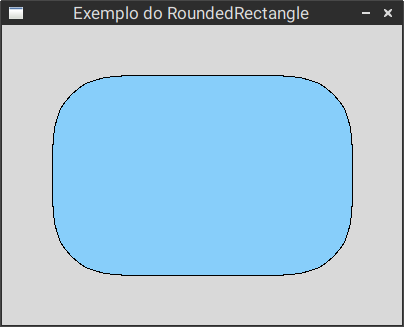

*Quickstart*
============

Desenhar um retângulo com os cantos arredondados
------------------------------------------------

.. code-block:: python

    import graphics
    from graphics_extra import RoundedRectangle

    win = graphics.GraphWin('Exemplo do RoundedRectangle', 400, 300)

    rect = RoundedRectangle(
        graphics.Point(50, 50),
        graphics.Point(350, 250),
        radius=100
    )
    rect.setFill('light sky blue')

    rect.draw(win)

   Resultado do exemplo acima
